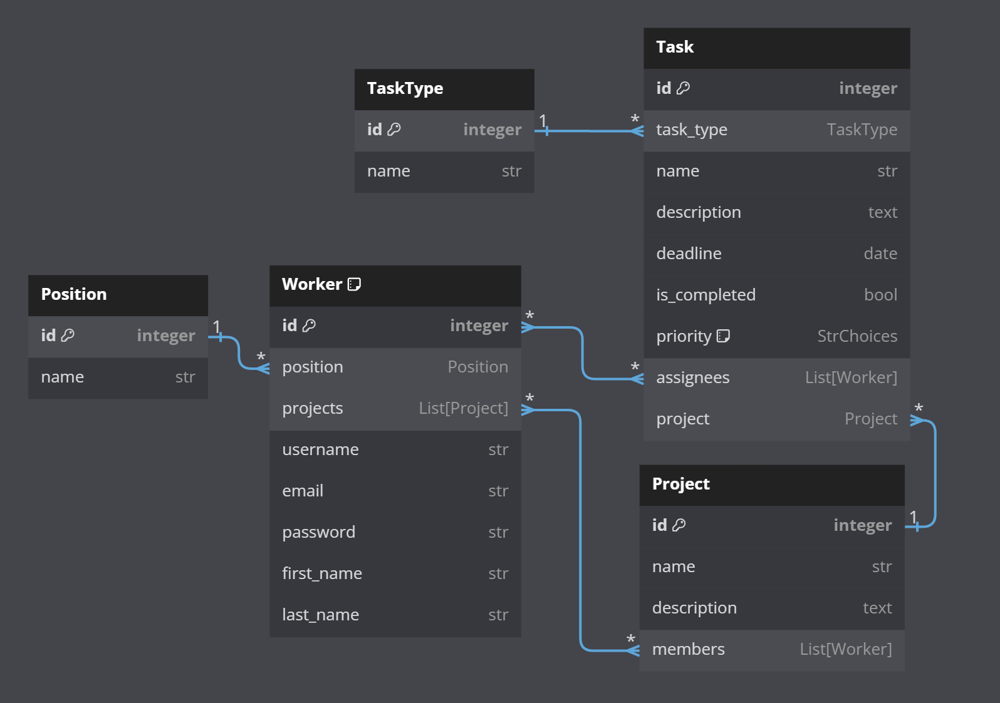
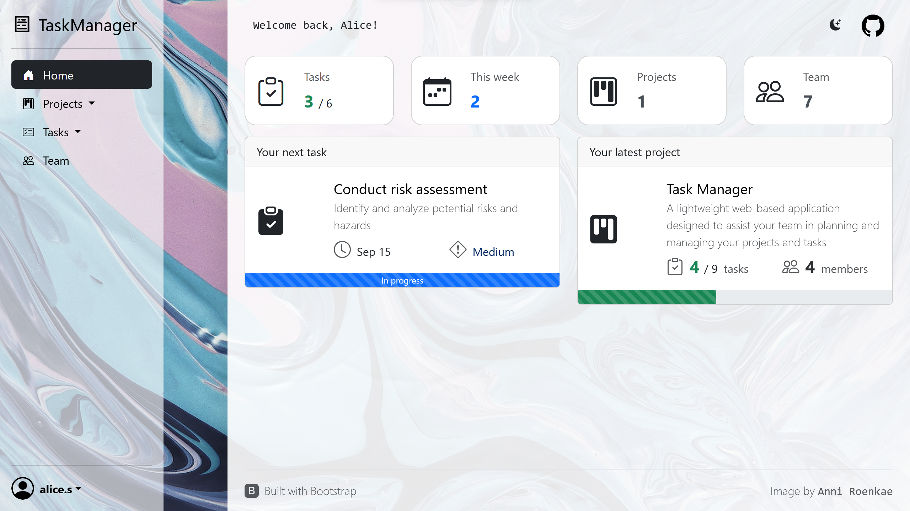
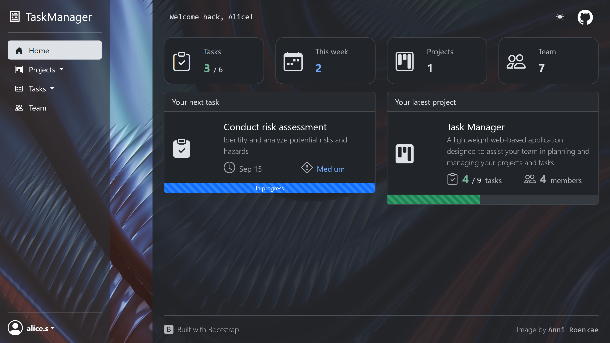

# Task Manager

Task Manager is a lightweight web-based application designed to assist a small team in managing their projects.

Built using `Django` & `Bootstrap 5`

## Features

1. **Authentication system**: create a new account and login using username and password

2.  You can **update your personal information** on your profile page

3. **Manage projects and tasks** using web interface

- Join or create projects, add team members
- Create tasks for projects, assign them to other members of the project
- Track task progress on your profile page, project page or in the task list
- Search and filter tasks on the task list page

4. Or use the **admin panel** for advanced management

## Getting started

### Check it out

> [Task Manager deployed on Render](https://task-manager-fgk9.onrender.com)

#### You can sign in as the test user (or create a new account):

```
username: test
password: 1qazcde3
```

### Prerequisites

> Python 3 is required

### Installation

*Rename `.env.sample` file to `.env` and update environment variables accordingly*

```shell
# clone the repo
git clone https://github.com/Esxoyne/it-company-task-manager.git
cd it-company-task-manager

# create and activate a virtual environment
python -m venv venv
source venv/bin/activate            # on Linux/macOS
venv\Scripts\Activate               # on Windows

# install dependencies
pip install -r requirements.txt

# start the server on localhost
python manage.py runserver
```

The application is running at `http://127.0.0.1:8000/`

## DB diagram
ER diagram generated using https://dbdiagram.io/



## Demo





## Attributions

#### Background images

by [Anni Roenkae](https://www.pexels.com/@anniroenkae/)

#### Bootstrap 5
is licensed under [MIT License](https://opensource.org/license/mit/)
